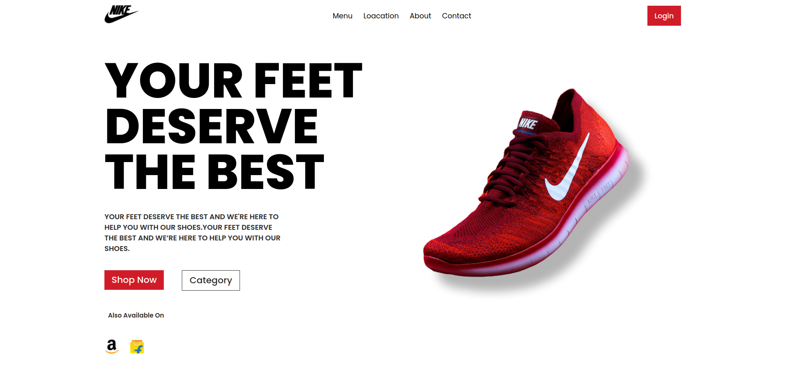
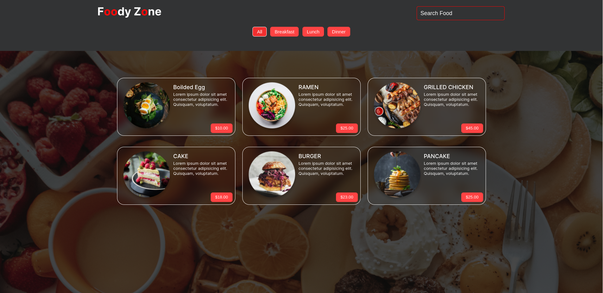

# Vite React Projects

This repository contains a collection of React projects built using Vite. Each project is organized into its own directory within the repository.

## Installation

To run any of the projects locally, follow these steps:

1. Clone the repository:

   ```bash
   git clone https://github.com/aayush105/react-projects.git
   ```
   
2. Navigate to the project directory:

   ```bash
   cd react-projects
   ```  
3. Navigate to the project you want to run:

   ```bash
   cd <project-name>
   ```
4. Install the dependencies:

   ```bash
    npm install
    ```
5. Run the project:

   ```bash
   npm run dev
   ```
The project will be available at http://localhost:5173 in your browser.

## Projects

### Project 1: [Brand-page](Brand-page)
This project utilizes React to create a straightforward brand page. 

### Project 2: [Contact-page](contact-us)
This project utilizes React to create a straightforward contact page. Also, it uses [react-hook-form](https://react-hook-form.com/) to validate the form.

### Project 3: [Dice-game](Dice-game)
This React-based project introduces a simple and engaging dice game. Players choose a number, roll the dice, and score points if the selected number matches the rolled dice. Incorrect guesses incur a penalty of 2 points. Enjoy the thrill of chance in this entertaining game.

### Project 4: [Food-Zone](Food-zone)

A React-based project, Foody Zone, invites you to explore a diverse culinary experience. Utilizing a visually appealing interface, users can seamlessly search for and filter food items based on type. The project incorporates fetching data from a specified API endpoint and dynamically updates the UI with the latest information.

Key Features:
- **Dynamic Data Loading:** Fetches and displays food data from a specified API endpoint.
- **Search Functionality:** Enables users to search for specific food items in real-time.
- **Filtering by Type:** Offers filter buttons for categorizing food items into breakfast, lunch, dinner, or all.
- **Styled Components:** Utilizes styled-components for a visually pleasing and responsive design.
- **Error Handling:** Provides a user-friendly error message in case of data fetching issues.

### Project 5: [Firebase-contact-app](Firebase-contact-app)

The Firebase Contact App is a versatile solution for managing your contact list efficiently. Built with React, it provides a user-friendly interface for adding, editing, deleting, and searching contacts stored in a Firebase database.

## Key Features
- **Firebase Integration:** Seamlessly integrates with Firebase, enabling secure storage of contact data in the cloud.
- **Add, Edit, Delete Contacts:** Allows users to add new contacts, edit existing ones, and delete outdated entries effortlessly.
- **Real-time Data Synchronization:** Utilizes Firebase's real-time database capabilities to ensure instant synchronization of contact list changes across all devices.
- **Search Functionality:** Enables quick and easy search for specific contacts by name or email, enhancing productivity.
- **Responsive Design:** Implements responsive design principles for optimal viewing and interaction experiences across various devices and screen sizes.
- **Error Handling:** Provides informative error messages to guide users in case of data manipulation or connectivity issues, ensuring a smooth user experience.

### Project 6: [Crypto Dashboard](crypto-dashboard)

Crypto Dashboard is a React-based web application designed to cater to cryptocurrency enthusiasts' needs. It offers real-time insights, portfolio management tools, and transaction capabilities.

## Key Features
- **Dashboard:** A comprehensive overview of cryptocurrency prices and portfolio performance.
- **Support:** Access to customer support and assistance.
- **Transaction:** Facilitation of cryptocurrency transactions with a feature-rich interface.

Key packages include \`@chakra-ui/react\` for UI components, \`framer-motion\` for animations, and \`react-router-dom\` for navigation.


## Output

### Project 1 Output


### Project 2 Output


### Project 3 Output


### Project 4 Output



### Project 5 Output


### Project 6 Output


